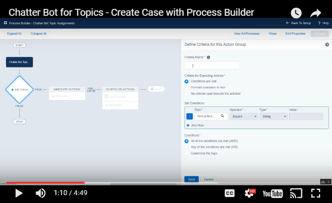
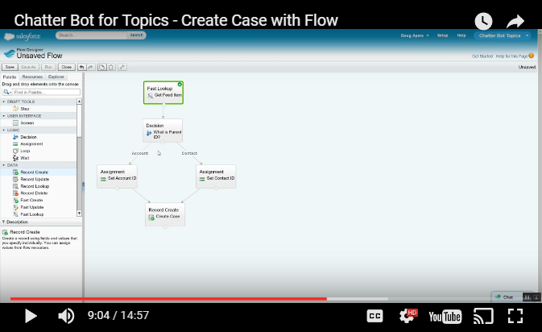

Salesforce Chatter Bot for Topics
=================================

---

# As of [Spring '18](https://releasenotes.docs.salesforce.com/en-us/spring18/release-notes/rn_networks_process_more_objects.htm), this project is no longer necessary. The capability is now native to the platform.

---

Overview
--------

Chatter Bot for Topics is a way to easily listen for topic assignments to a Chatter post and take action.
An example would be to automatically create a Case when a topic is assigned to a Chatter post.
Unfortunately, you cannot just leverage Process Builder to monitor the creation of a TopicAssignment object.
This project makes it easy by monitoring the topics that you want and then creating a custom object that you can leverage within Process Builder.

For background details, our inspiration, instructional videos, and what the future may hold, please [read our blog post](https://douglascayers.com/2016/11/13/create-case-when-chatter-topic-assigned-or-crm-ai-with-chatter-bot/).

Installation
------------

* [Deploy from Github](https://githubsfdeploy.herokuapp.com)

Getting Started
---------------

1. Deploy code using link above
2. Assign **Chatter Bot Topics Admin** permission set to your user
3. Switch to **Chatter Bot Topics** app
4. Create a new **Chatter Bot Topic** object with the topic name you want to listen for and set to active

Everytime a topic with that name is assigned to a Chatter post then a **Chatter Bot Topic Assignment** will be created. You can use Process Builder to execute when that object is created and take any actions that you need.

Chatter Bot for Topics Video Tutorials
--------------------------------------

Learn how to quickly create a new case on topic assignment using just Process Builder.

Learn how to create a new case and post comment back with link to that case using Flow.

